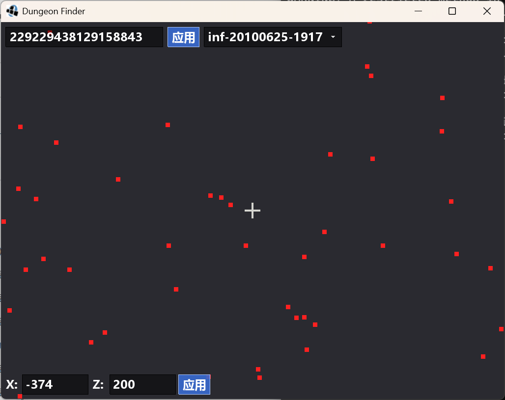

# Dungeon Finder (Java)

一个用于查找 Minecraft 版本 `inf-20100625-1917` 至 `b1.7.3`中**地牢**（含刷怪笼）位置的可视化工具，是 Rust/WASM 版 [monolith-renderer](https://github.com/kahomayo/monolith-renderer) 生态的 Java + LWJGL2 衍生项目。

地牢生成依赖 3D 地形（含洞穴），因此本工具逐区块复刻完整地形后判定地牢位置，结果与游戏内部生成完全一致；渲染时仅使用 X/Z 平面。



## 功能

- 复刻旧版 Minecraft 的 3D Perlin 噪声与 `ChunkGenerator` 世界生成算法（bit-exact，已验证与 Rust 测试向量一致）。
- 逐区块模拟完整 `provideChunk`（含洞穴）+ `populate` RNG + `WorldGenDungeons` 判定，精确重现地牢位置。
- 支持多个版本的箱子 loot 差异（影响刷怪笼怪物类型），种子框右侧下拉菜单可切换版本并自动重建缓存。
- 以瓦片形式渲染地图，每个瓦片 = 一个区块（16×16 方块，1 方块/像素），地牢以红色标记在画面上。
- 异步瓦片加载（后台线程用满所有核心），缩放 / 平移流畅不卡顿。
- 点击红点显示地牢完整坐标（XYZ）+ 刷怪笼怪物 ID。
- 画面中心 MC 样式反色十字准星。
- 左上角种子输入框、左下角坐标输入框，可随时跳转与修改。
- 临时磁盘缓存：已加载区块缓存到磁盘，程序退出时自动删除。
- 可缩放窗口（拖动边缘 / 最大化自适应）。

## 运行

依赖：JDK 8+（建议 17+）。`lib/` 下已包含 LWJGL2 运行库。

```bat
compile.bat          :: 编译源码并打包为 dungeon-finder.jar
run.bat [seed]       :: 运行打包好的 jar
```

例：先执行 `compile.bat`，再执行 `run.bat 8676641231682978167`。

首次编译会自动解压 native 库到 `natives/`。

### 操作

- 鼠标左键拖拽 / 方向键 / WASD：平移
- 滚轮 / `+` / `-`：缩放（向上滚轮放大）
- 点击红点：显示地牢的完整坐标（XYZ）与刷怪笼怪物 ID
- 左上角输入框：修改种子（含应用按钮）
- 种子框右侧下拉菜单：切换游戏版本（含 V 图标），切换后自动重建并清除缓存
- 左下角输入框：修改 X / Z 坐标（含应用按钮）
- `R`：随机种子
- `Esc`：退出

## 支持版本

工具内置 5 个预置版本，覆盖不同版本的「箱子 loot RNG 消费」实现（红石 / 唱片 / 可可豆的加入会改变 RNG 消费顺序，从而影响刷怪笼怪物 ID）：

| 预置版本 | 覆盖范围 |
|---------|---------|
| `inf-20100625-1917` | `inf-20100625-1917` ~ `inf-20100630-1835` |
| `a1.0.1` | `a1.0.1` ~ `a1.0.13_01` |
| `a1.0.14` | `a1.0.14` ~ `a1.2.5` |
| `a1.2.6` | `a1.2.6` ~ `b1.3_01` |
| `b1.4` | `b1.4` ~ `b1.7.3` |

> 说明：由于版本间箱子 loot 的 RNG 消费实现不同，需按目标版本选择对应预置。

## 验证

运行 `verify.bat` 可校验核心算法，应输出全部测试向量通过，并统计固定种子固定范围的地牢数量。

## 目录结构

```
src/                  Java 源码
docs/                 开发文档
lib/                  LWJGL2 运行库
natives/              本地库（首次编译自动生成）
build/                编译中间输出
dungeon-finder.jar    打包产物（由 compile.bat 生成）
```

## 开发

详见 [docs/development.md](docs/development.md)。

## 许可与来源

本项目为 [kahomayo/monolith-renderer](https://github.com/kahomayo/monolith-renderer) 的 fork 衍生项目，原仓库未声明许可证（默认保留所有权利）。

本仓库中的 Java 移植实现（`src/`）由本 fork 维护者编写，欢迎用于学习与二次开发。原 Rust 算法部分版权归原作者所有，若原作者要求移除相关内容，本仓库会配合处理。